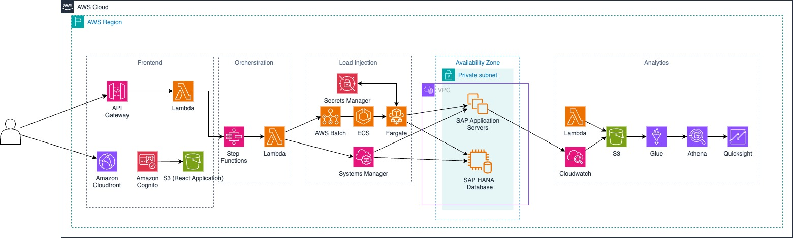
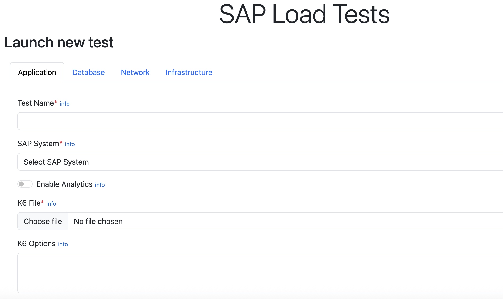

# SAP Load Tests: A Serverless Approach

## Table of Contents

- [Overview](#overview)
  - [Architecture](#architecture)
  - [Cost](#cost)
- [Prerequisites](#prerequisites)
- [Deployment Steps](#deployment-steps)
  - [Infrastructure Deployment](#infrastructure-deployment)
  - [SAP System Definition Deployment](#sap-system-definition-deployment)
  - [Analytics Stack (Optional)](#analytics-stack-optional)
- [Load Test Scenarios](#load-test-scenarios)
  - [Infrastructure Load Tests](#infrastructure-load-tests)
  - [Database Load Tests](#database-load-tests)
  - [Application Load Tests](#application-load-tests)
    - [IDocs Scenario](#idocs-scenario)
    - [Fiori Scenario](#fiori-scenario)
- [Usage](#usage)
  - [Web Interface](#web-interface)
  - [Monitoring and Metrics](#monitoring-and-metrics)
- [Cleanup](#cleanup)
- [Disclaimer](#disclaimer)
- [Support](#support)
- [Next Steps](#next-steps)

## Overview

SAP Load Tests is a serverless solution for conducting load and performance testing on SAP systems running natively on AWS or within a RISE environment. This solution leverages AWS services to provide a scalable, repeatable and cost-effective approach to load testing in SAP environments without requiring a dedicated testing infrastructure.

### Architecture



The solution consists of the following components:

1. **Infrastructure Stack**: Core AWS resources including:

   - AWS Lambda functions for orchestration and integration across AWS services
   - Step Functions for workflow management
   - AWS Batch for running containerized load tests
   - S3 buckets for storing artifacts and performance metrics
   - CloudWatch for realtime monitoring and dashboards
   - API Gateway and Cognito for the web interface
   - CloudFront distribution for secure, low-latency access to the web interface
   - IAM roles for granting proper permissions

2. **SAP System Stack**: System-specific resources including:

   - CloudWatch dashboards tailored to each SAP system
   - Secrets Manager secrets storing system credentials (SAP and HANA database)
   - System-specific configuration (e.g., EC2 instance IDs, HANA and SAP system numbers, etc)

3. **Analytics Stack (Optional)**: Data analysis components including:
   - Glue database and tables
   - Athena workgroup for SQL queries
   - IAM roles for analytics access

### Cost

The solution is designed to be cost-effective by using serverless components that scale to zero when not in use. The primary cost drivers are:

- AWS Batch compute resources during test execution
- S3 storage for artifacts and metrics
- CloudWatch dashboards and metrics storage
- CloudFront data transfer (minimal for typical usage patterns)
- Lambda functions during load tests executions

## Prerequisites

Before deploying this solution, you need:

1. AWS CLI and CDK installed and configured
2. Node.js and npm installed
3. An existing VPC with appropriate subnets
4. An SAP system running on EC2 instances
5. Appropriate IAM permissions to deploy the required resources
6. For infrastructure based load tests, the following tools need to be installed at Operating System level
  - stress-ng --> https://github.com/ColinIanKing/stress-ng
  - fio --> https://github.com/axboe/fio

## Deployment Steps

### Infrastructure Deployment

Deploy the core infrastructure stack:

```bash
cdk deploy \
  --context vpcId=vpc-xxxxxxxxxxxxxxxxx \
  --context subnetIds=subnet-xxxxxxxxxxxxxxxxx,subnet-yyyyyyyyyyyyyyyyy \
  --context adminEmail=admin@example.com \
  --context deployAnalytics=true \
  SAPLoadTests-InfrastructureStack
```

### SAP System Definition Deployment

Deploy the SAP system-specific stack:

```bash
cdk deploy \
  --context sapApplicationIntanceIds=i-xxxxxxxxxxxxxxxxx,i-yyyyyyyyyyyyyyyyy \
  --context dbInstanceId=i-zzzzzzzzzzzzzzzzz \
  --context dbPort=<HANA Port, e.g. 30015> \
  --context dbName=<HANA SID, e.g. HDB> \
  --context sapSID=SID \
  --context sapClient=<SAP client> \
  --context sapBaseUrl=<SAP url https://sap-system-url.example.com> \
  SAPLoadTestsDataStack-SID
```

### Analytics Stack (Optional)

To deploy the analytics stack for advanced metrics analysis (in case deployAnalytics=false was used during infrastructure deployment):

```bash
cdk deploy \
  --context vpcId=vpc-xxxxxxxxxxxxxxxxx \
  --context subnetIds=subnet-xxxxxxxxxxxxxxxxx,subnet-yyyyyyyyyyyyyyyyy \
  --context adminEmail=admin@example.com \
  --context deployAnalytics=true \
  SAPLoadTests-InfrastructureStack
```

## Configuration Steps

Once the SAP system-specific stack has been deployed successfully, a Secrets Manager secret will need to be updated. 
In detail, the following entries must be maintained:

  - sapBaseUrl (URL of the target SAP system, without any prefix)
  - sapClient (client used for the load tests)
  - dbUser / dbPassword (HANA database user credentials)
  - sapUser / sapPassword (SAP system user credentials)

## Load Test Scenarios

### SAP Application Load Tests

2 scenarios are included in the samples folder

#### Sales Orders IDocs Scenario

This test sends IDocs to the SAP system via HTTPS using the xml interface and creates sales orders. The sample provided uses the <b>SALESORDER_CREATEFROMDAT202</b> idoc/message type.
In order to successfully create idoc in the target SAP system, the following parameters need to be adjusted in the sample_idoc_ID1.xml file:

Control data records (required for successful idoc processing)
  - MANDT (SAP client)
  - IDOCTYP and MESTYP (idoc and message types)
  - SNDPOR, SNDPRT and SNDPRN (details from the sender port/port number/function)
  - RCVPOR, RCVPRT and RCVPRN (details from the receiver port/port number/function)

These details can be extracted from the SAP sytem using transaction WE20/WE21

Message data records can be adjusted as required , for example SALES_ORG, DISTR_CHAN, INCOTERMS1 and INCOTERMS2. 

It is recommended to directly create a sample Idoc in the system with transaction WE19 and adjust the settings accordingly as required.

Once customization is completed, create a zip file containing both the xml and the js file and upload it in the application UI

The following code block needs to be adjusted as per load test requirements

```javascript

const xmlfile = open('./sample_idoc_ID1.xml'); ----> xml file containing the sample idoc

export const options = {
  vus: 5,  ----> number of virtual users to simulate
  duration: '60s', ----> duration of the test 
  insecureSkipTLSVerify: true, ----> required to avoid errors due to self signed ssl certificates in SAP system
};
```

Parameters like virtual users and duration can be overriden by directly entering values wihtin the UI, for example

```console
--vus 10 --duration 120s --insecure-skip-tls-verify
```

For user rampup/rampdown scenarios, the following example command line can be used (simularint 10 users for 180 seconds, then 500 users for 10 minutes and again 10 users for 180 seconds)

```console
-s 180s:10 -s 600s:500 -s 180s:10 --insecure-skip-tls-verify
```

#### Fiori Scenario

This scenario simulates end users accessing the SAP system through the Fiori frontend. It does not change any data in the system, it only fetches information using the API_SALES_ORDER_SRV odata api displaying the first 1000 sales orders.

### Database Load Tests

Test targeting the SAP HANA database, creating a sample table and performing insert/update/delete operations. Similarly to SAP Application tests, code samples can be adjusted as required by updating the following code in file simpleHana.js

```javascript
export function setup() {
  db.exec(`
  CREATE COLUMN TABLE test_table (
    A INT GENERATED BY DEFAULT AS IDENTITY,
    B TEXT,
    C INT,    /* Random integer */
    D DECIMAL(10,2)  /* Random decimal */
    );
  `);
}
```

The database test uses the k6 HANA SQL extension written in go to connect directly to HANA db and execute queries. 

### Infrastructure Based Load Tests

These 2 tests (Infrastructure and Network) are focused on the underlying AWS infrastructure performance, including:

- EC2 instance performance (CPU, Memory)
- Storage performance (IOPS/Throughput)
- Network latency (introducing additional network latency / delay)

CPU / Memory / Storage load test can give some guidance on a specific EC2 instance configuration (Intel/AMD instance types), storage configuration (gp3/io2) or a combination. Useful for rightsizing exercises in case no application testing is possible.

The default rampup/rampdown settings and duration are defined within Step Function sap-load-tests-orchestrator under API parameters of Lambda functions Infrastructure Warmup/Infrastructure Load Test/Infrastructure Rampdown

    "jobs": "4",
    "duration": "5",
    "cpu_load": "25",
    "mem_load": "65"

Network latency test can be useful in simulating scenarios where a system has been migrated to AWS (e.g., SAP BW) while others are still running on premise (ERP). 

The linux kernel comand tc to introduce latency on the primary network interface.

## Usage

### Web Interface



After deployment, access the web interface using the URL provided in the CloudFormation outputs. The interface allows you to:

1. Select the test scnario (Application/Database/Infrastructure/Network)
2. Select the SAP system to run the tests
3. Configure test scenario and parameters (duration, virtual users, etc.) and upload the k6 scenarios
3. Start and monitor test executions
4. View test results and metrics

Note: k6 scenarios must be uploaded in a zip format, any js file will be discarded and the test will fail!

Default parameters as virtual users and duration can be overridden by entering proper k6 parameter values as described above.

### Monitoring and Metrics

The solution provides several monitoring options:

1. **CloudWatch Dashboards**: System-specific dashboards showing:

   - SAP application server metrics
   - Database performance metrics
   - Test execution metrics
   - AWS infrastructure metrics

2. **Analytics (if deployed)**: Query test metrics using Athena:
   ```sql
   SELECT * FROM sap_load_tests.cw_metrics
   WHERE sid = 'SID' AND test_type = 'application'
   ORDER BY timestamp DESC
   LIMIT 100;
   ```

## Cleanup

To remove the deployed resources:

```bash
# Remove SAP system definition stack
cdk destroy SAPLoadTestsDataStack-SID

# Remove infrastructure stack
cdk destroy SAPLoadTests-InfrastructureStack
```

## Disclaimer

This solution is provided as-is without any warranties. Always test in non-production environments before using in production contexts.

## Support

For any support or technical questions please contact us at sap-load-tests@amazon.com.

## Next Steps

- Create Quicksight dashboards for reporting
- Add Amazon Managed Grafana stack for realtime monitoring
- Add support for additional SAP S/4HANA tests
- Autonomous testing through AI Agents
